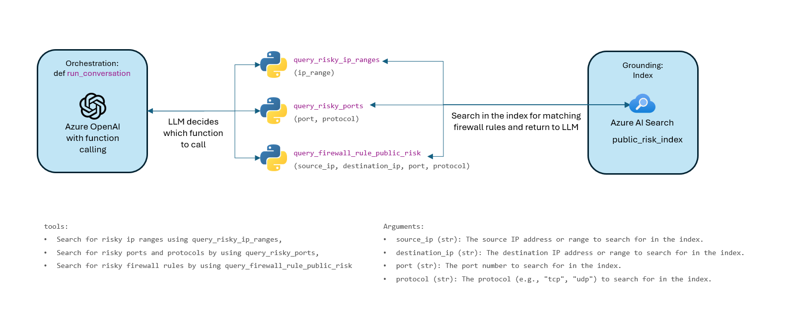

# Firewall-agent-checker

## Architecture
### Overview
The Firewall Risk Assessment Assistant is an intelligent, natural language-based tool designed to help evaluate the risk level of Azure Firewall rules. It combines Azure OpenAI's function calling with Azure AI Search to deliver accurate, context-aware assessments using the Retrieval-Augmented Generation (RAG) pattern.

### Core Capabilities
#### Risk Evaluation
Assesses firewall rules by analyzing source IPs, destination IPs, ports, and protocols. Uses public risk data indexed in Azure AI Search to make informed evaluations.

#### Smart Function Calling
Automatically selects the right function based on available input:
- query_risky_ip_ranges(ip_range)
- query_risky_ports(port, protocol)
- query_firewall_rule_public_risk(source_ip, destination_ip, port, protocol)

See this illustration for further explanation:


#### Risk Scoring and Classification
Uses CVSS scores (Common Vulnerability Scoring System) when available:
- High Risk: ≥ 7.0
- Medium Risk: 4.0–6.9
- Low Risk: < 4.0
- If no CVSS data is found, the assistant applies logical inference based on available evidence.

#### Confidence Score
Outputs include a confidence score (0–100%) reflecting the completeness and reliability of the underlying data.

#### Recommendations
For each rule evaluated, one of the following recommendations is given:
- Block this rule
- Monitor this rule
- Allow this rule

#### Output Format
Results are returned in CSV format, structured as follows:

```csv
source_ip,destination_ip,port,protocol,cvss_score,description,recommendation,ai_risk_assessment,confidence_score_percentage
```

- Headers are always included.
- "N/A" is used where data is not available.
- Designed for easy integration into reporting pipelines or security dashboards.


## Setup
For the project to run, you need to setup a few resources on Azure, and also prepare your local environment for it. The following guide walks you through the steps.

Overview on the setup requirements:


### Azure Setup
#### Deploy Azure Resources
1. Deploy an Azure OpenAI service
2. Deploy an Azure OpenAI model deployment (e.g. gpt-4o)
3. Deploy an Azure Storage Account (ADLS Gen2) with hierarchical namespace enabled
4. Deploy and Azure AI Search Service (if no networking requirements exist, you can choose "Free" or "Basic" tier)

#### Upload Data
Note: Code already is capable to upload the data directly to storage account. Could be automated very easily, but for the scope of the PoC this was not done.
1. Create two file system in the storage account ("risks", "test")
2. Upload the risk data ("general_network_risks.csv") into the risk file system
3. Upload the test data ("test_data.csv") into the test file system

#### Create AI search index
- Use the import function in AI Search to index the general network risks
- Make sure to use the "delimitedText" parsing method to capture the columns of the CSV
- Modify the index and make sure to adjust the retrievable, searchable fields etc --> refer to the screenshot for the index configuration
- Verify the success of the indexing process by querying the index in the portal through the search explorer


#### Retrieve connection information
- Retrieve all required information regarding endpoints and keys from the Azure resources
- This will be needed to fill out the .env file

### Local Setup
#### Create virtual environment
##### 1. If you're not already in the folder where you want the environment:
```bash
cd /path/to/your/project
```

##### 2. Create virtual environment
```bash
python -m venv .venv
```

##### 3. Activate virtual environment
On macOS/Linux/WSL:
```bash
source .venv/bin/activate
```

On Windows CMD:
```cmd
.venv\Scripts\activate.bat
```

On Windows PowerShell:
```powershell
.venv\Scripts\Activate.ps1
```

#### Install requirements
```bash
pip install -r requirements.txt
```

#### Fill out .env variables
- Create .env file (in the root of the repository)
- Example for .env file is shown in the file "env.example"
- Fill out all environment variables with the required information

## Security remaks
- The code in this repository is implemented with a PoC mindset - security best practices were not applied
- If you want to use this code in production, revisit the following issues:
    - Switch from key-based authentication to identity-based authentication
    - Implement Azure resources with private networking integration
    - Do not run Jupyter notebook locally, but run it on Azure