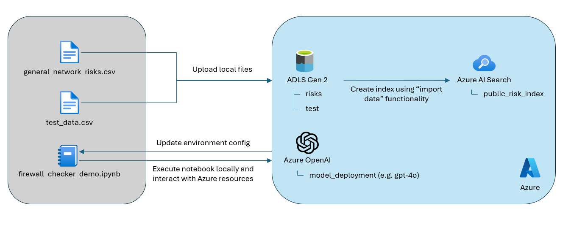
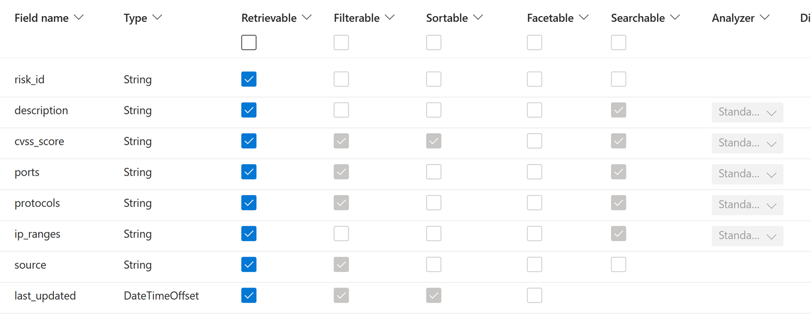

# Firewall-agent-checker

## Architecture


## Setup
### Configure Resources
Overview on the setup requirements:


#### Deploy Azure Resources
1. Deploy an Azure OpenAI service
2. Deploy an Azure OpenAI model deployment (e.g. gpt-4o)
3. Deploy an Azure Storage Account (ADLS Gen2) with hierarchical namespace enabled
4. Deploy and Azure AI Search Service (if no networking requirements exist, you can choose "Free" or "Basic" tier)

#### Upload Data
Note: Code already is capable to upload the data directly to storage account. Could be automated very easily, but for the scope of the PoC this was not done.
1. Create two file system in the storage account ("risks", "test")
2. Upload the risk data ("general_network_risks.csv") into the risk file system
3. Upload the test data ("test_data.csv") into the test file system

#### Create AI search index
- Use the import function in AI Search to index the general network risks
- Make sure to use the "delimitedText" parsing method to capture the columns of the CSV
- Modify the index and make sure to adjust the retrievable, searchable fields etc --> refer to the screenshot for the index configuration
- Verify the success of the indexing process by querying the index in the portal through the search explorer


### Create virtual environment
#### 1. If you're not already in the folder where you want the environment:
```bash
cd /path/to/your/project
```

#### 2. Create virtual environment
```bash
python -m venv .venv
```

#### 3. Activate virtual environment
On macOS/Linux/WSL:
```bash
source .venv/bin/activate
```

On Windows CMD:
```cmd
.venv\Scripts\activate.bat
```

On Windows PowerShell:
```powershell
.venv\Scripts\Activate.ps1
```

### Install requirements
```bash
pip install -r requirements.txt
```

### Fill out .env variables
Example for .env file is shown in the file "env.example"


